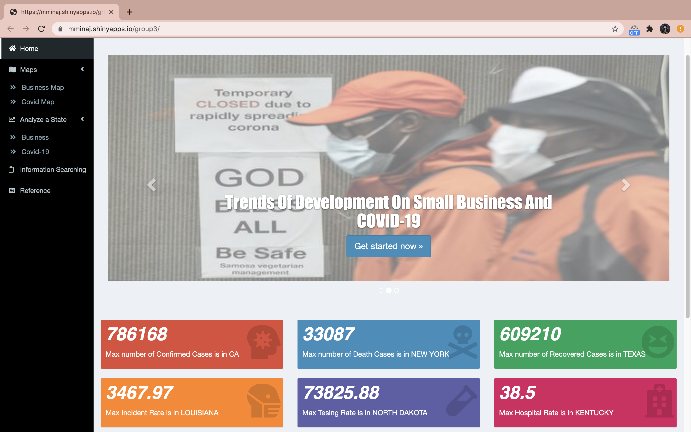
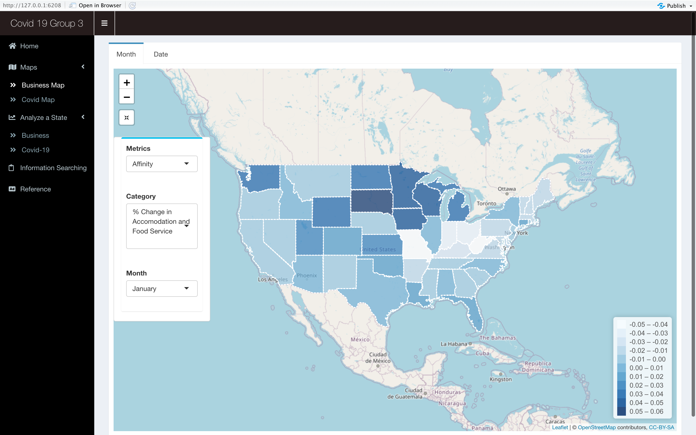
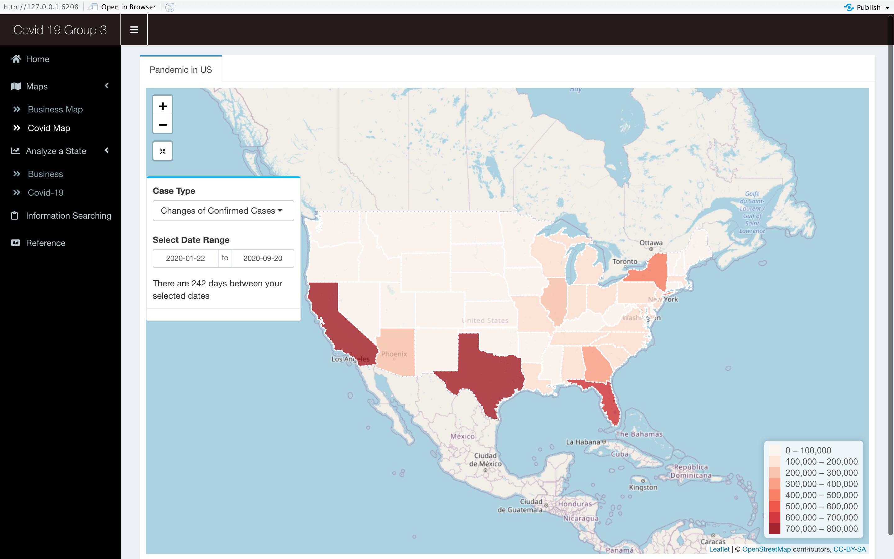
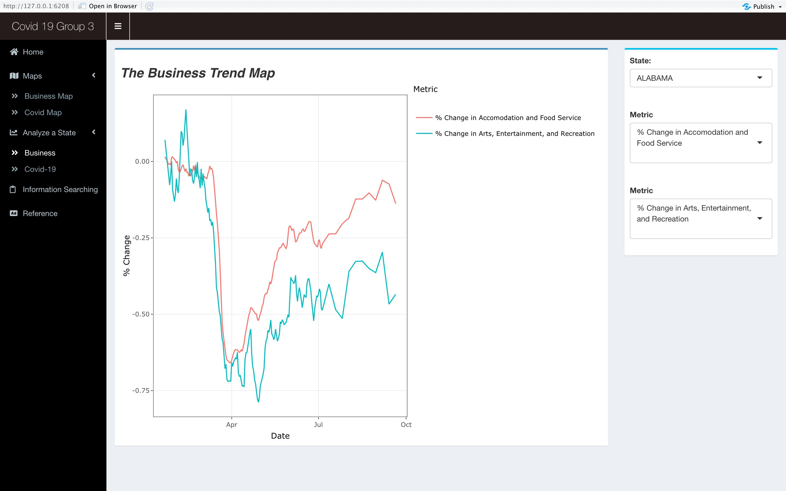
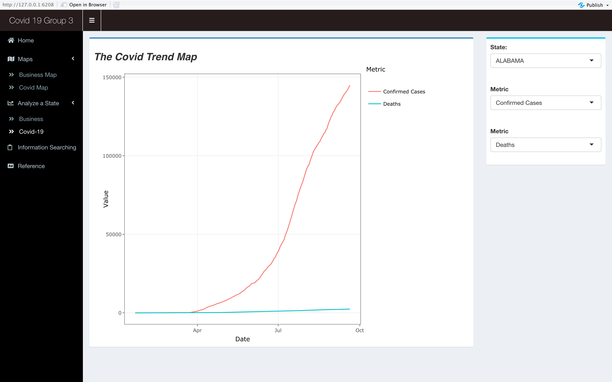
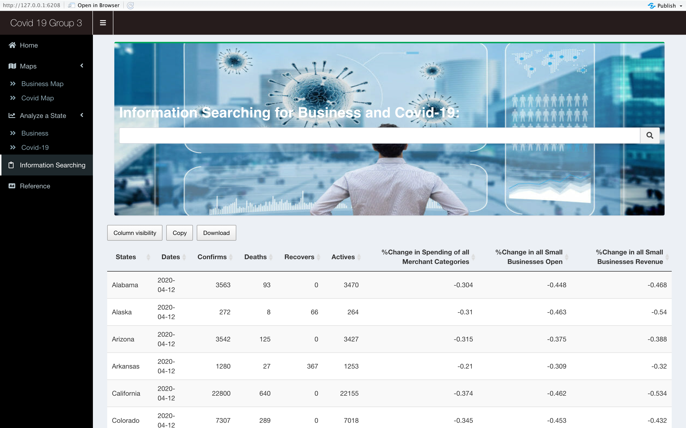

# Project 2: Shiny App Development

### [Project Description](doc/project2_desc.md)









In this second project of GR5243 Applied Data Science, we develop a *Exploratory Data Analysis and Visualization* shiny app using [JHU CSSE Covid-19 Data](https://github.com/CSSEGISandData/COVID-19). See [Project 2 Description](doc/project2_desc.md) for more details.  

## Project Title: How COVID-19 Pandemic Affects Small Businesses in US
Term: Fall 2020

+ Team #3

+ **Project title**: How COVID-19 Pandemic Affects Small Businesses in US

+ Team members
	+ Xinyi Wei
	+ Yunuo Ma
	+ Minzhi Zhang
	+ Mina Jiang (Presenter)
	
+ Shiny Link: https://mminaj.shinyapps.io/group3/

+ Additional Source of Dataset: We used [Opportunity Insights Economic Tracker Data](https://www.kaggle.com/douglaskgaraujo/opportunity-insights-real-time-economic-tracker-us?select=data) This dataset is created as part of Opportunity Insights' Economic Tracker, which you can access directly (and with a very nice user interface) at (https://www.tracktherecovery.org) 

Here is also a related documentation:
"How Did COVID-19 and Stabilization Policies Affect Spending and Employment? A New Real-Time Economic Tracker Based on Private Sector Data", by Raj Chetty, John Friedman, Nathaniel Hendren, Michael Stepner, and the Opportunity Insights Team. June 2020. Available at: https://opportunityinsights.org/wp-content/uploads/2020/05/tracker_paper.pdf

+ **Project summary**: Our project developed a Shiny App with information about COVID-19 in US regarding to economical circumstances for small businesses. Our data is from both JHU CSSE COVID-19 Data and Opportunity Insights Economic Tracker Data (listed above). In particular, we further analyzed metrics about small businesses including affinity of consumer, revenue and merchant of small businesses, and indicators about COVID-19 including 4 categories of cases and 3 categories of rates corresponding to different states in US. COVID-19 has dramatically altered everyone's life pattern and this app could provide everyone in US with information about pandemic situation. Moreover, this app is also aimed to help local small business owners so that they could gather some useful information here in order to formulate future business strategies and improve their future operating conditions. We hope to support everyone in US especially for small business owners. Together, we're relentlessly fighting COVID-19!

+ **Contribution statement**: 

+ Xinyi Wei: Carried out data pre-processing for the merge_data cvs and business map page. Designed, developed and finalized the business date and month map. Created the HTML interactive home page part and finalized with Yunuo Ma. Built the Search Information page with Yunuo Ma. Designed and added informative and interesting filter parts to complete the shiny structure. 
+ Yunuo Ma: Came up with essential ideas include providing information about the additional dataset and setting up goals and orientations of the project in the brainstorming step. Carried out data pre-processing on the covid19 dataset. Designed, developed, and finalized covid19 map page, and implemented 6 value boxes and boxplot of the home page. Built and optimized searching features in collaboration with Xinyi to finalize the Search Information page. Provided detailed project information on the README file.

All members approve our work presented in our GitHub repository including this contribution statement.

Following [suggestions](http://nicercode.github.io/blog/2013-04-05-projects/) by [RICH FITZJOHN](http://nicercode.github.io/about/#Team) (@richfitz). This folder is organized as follows.

```
proj/
├── app/
├── lib/
├── data/
├── doc/
└── output/
```

Please see each subfolder for a README file.

